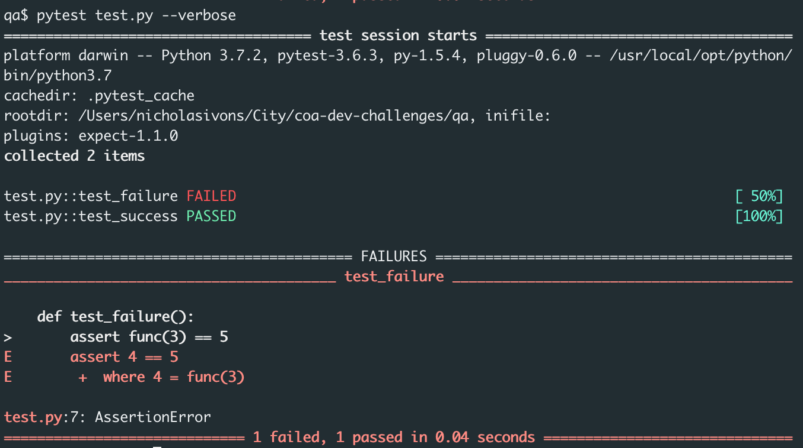

# QA Challenge

## The Test

The City of Austin needs a way to validate URLs! Thankfully, a URL validator has already been made - we just need you to test it!

We have an function that takes a URL and applies these rules:

1. Removes any duplicate query string parameters from the url
```
ex: validate_url('www.austintexas.gov?a=1&b=2&a=2')
returns: 'www.austintexas.gov?a=1&b=2'
```
2. Removes any query string parameters specified within the 2nd argument (optional array)
```
ex: validate_url('www.austintexas.gov?a=1&b=2', ['b'])
returns: 'www.austintexas.gov?a=1'
```
3. Converts any non-".gov" domain suffix to ".gov"
```
ex: validate_url('www.austintexas.com')
returns: 'www.austintexas.gov'
```

Your job is to write a series of tests to make sure that our function follows these 3 rules. These tests should validate that this code will not cause errors in production. If you do not have enough time to write out all the tests that you think are applicable, you can just list them.

If you happen to discover any bugs along the way:
  - write a failing test that catches it
  - write a quick bug report (what was expected, what actually happened, the name of the test that failed)

What we're looking for:
  - Ability to identify and test for edge cases.
  - Clean, well-documented code.

### Instructions

- You must work on this alone. Do not share the code challenge with others.
- Have fun! Be creative!
- We have a sample test file in `test.py` to get you started. However, you're free to use any language (though preferably python or nodejs), frameworks, tools, or libraries you like.
- If you decide to use a different framework, please include instructions for us to run your code.
- If you decide to use `test.py`, follow these steps to get it running:
  - Install the python requirements by running `pip install -r requirements.txt`
  - Within the qa directory, run the test suite with `pytest test.py --verbose`. You should see:
    
- Submit your answer to us by publishing it to a private github repo and inviting us to view it. If you're unfamiliar with github, let us know and we can arrange another way for you to deliver your solution to us (dropbox, email, etc). As long as we can run your code with `pytest test.py --verbose` (or whatever instructions you tell us), you're good.
